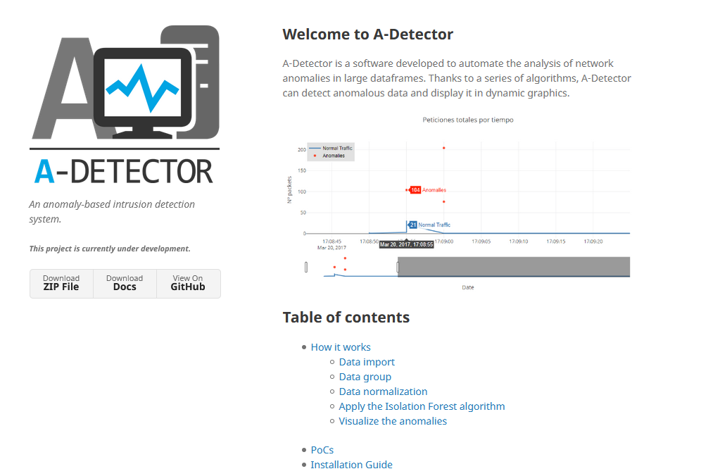

# A-Detector
An anomaly-based intrusion detection system. A-Detector is a software developed to automate the analysis of network anomalies in large dataframes. Thanks to a series of algorithms, A-Detector can detect anomalous data and display it in dynamic graphics.

 

Check more info in: https://adetector.github.io/ 

